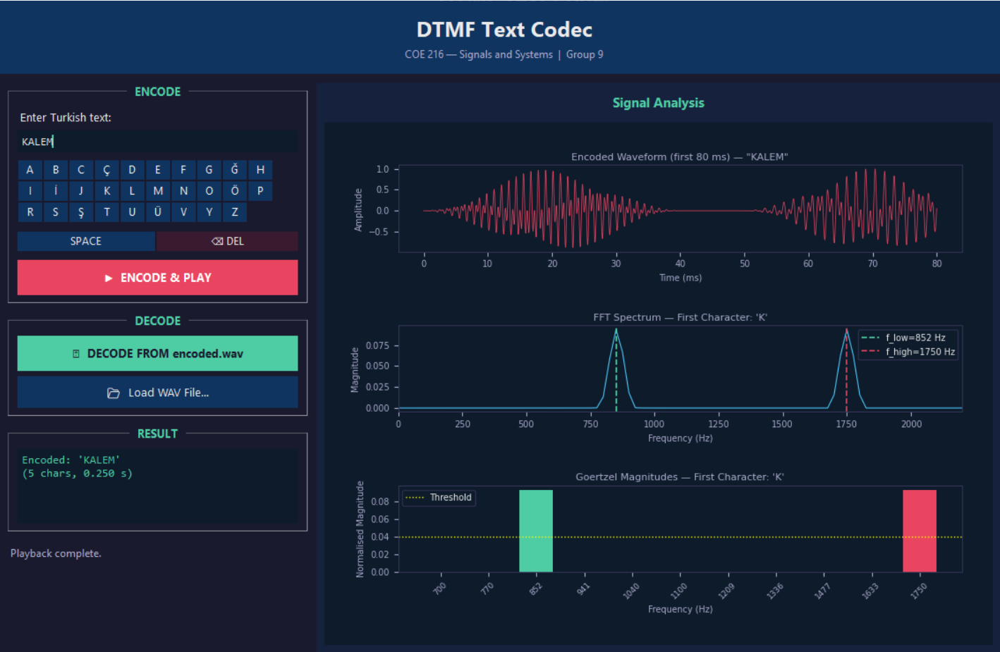

# Turkish DTMF Text Codec

A desktop application that encodes Turkish text into DTMF-style dual-tone audio signals and decodes them back — with a dark-themed GUI, real-time signal plots, and an on-screen Turkish keyboard.



---

## Table of Contents

- [Overview](#overview)
- [Features](#features)
- [How It Works](#how-it-works)
- [Frequency Map](#frequency-map)
- [Installation](#installation)
- [Usage](#usage)
- [Project Structure](#project-structure)
- [Technical Details](#technical-details)

---

## Overview

Standard DTMF (Dual-Tone Multi-Frequency) covers only 16 keys. This project extends the concept to all **30 characters of the Turkish alphabet** (29 letters + space) by defining a **6 x 5 frequency grid**. Each character is synthesised as a 40 ms dual-tone sinusoidal burst, saved to a `.wav` file, and later decoded using the **Goertzel algorithm**.

---

## Features

| Feature | Details |
|---|---|
| Character Set | 30 Turkish characters (A-Z + C, G, I, O, S, U with diacritics + Space) |
| Encoding | Hann-windowed dual-tone synthesis to `.wav` file |
| Decoding | Goertzel algorithm (Method A — static file analysis) |
| GUI | Dark-themed Tkinter with on-screen Turkish keyboard |
| Signal Plots | Waveform · FFT Spectrum · Goertzel Magnitude bars |
| Audio Playback | Real-time playback via `sounddevice` |
| Sampling Rate | 44 100 Hz |
| Tone Duration | 40 ms per character + 10 ms inter-symbol gap |

---

## How It Works

### Encoding

1. Each character maps to a unique `(f_low, f_high)` pair from the 6 x 5 grid.
2. A 40 ms dual-tone signal is synthesised:
   ```
   s(t) = sin(2*pi*f1*t) + sin(2*pi*f2*t)
   ```
3. The signal is amplitude-normalised and multiplied by a **Hann window** to suppress spectral leakage.
4. A 10 ms silence gap is appended between characters.
5. All character bursts are concatenated and saved as a 32-bit float `.wav` file.

### Decoding

1. The `.wav` file is loaded into memory.
2. A sliding window of `N_tone` samples steps through the signal with stride `N_tone + N_gap`.
3. The **Goertzel algorithm** computes the DFT magnitude at each of the 11 candidate frequencies in O(N) time.
4. The dominant low-band and high-band frequencies are identified; if both exceed `THRESHOLD = 0.04`, the matching character is appended to the result.
5. A debounce counter prevents duplicate detections within a single burst.

---

## Frequency Map

The 30 characters are arranged in a **6 x 5 grid**:

| | 1209 Hz | 1336 Hz | 1477 Hz | 1633 Hz | 1750 Hz |
|---|---|---|---|---|---|
| **700 Hz** | SPC | A | B | C | C with cedilla |
| **770 Hz** | D | E | F | G | G with breve |
| **852 Hz** | H | I | I with dot | J | K |
| **941 Hz** | L | M | N | O | O with umlaut |
| **1040 Hz** | P | R | S | S with cedilla | T |
| **1100 Hz** | U | U with umlaut | V | Y | Z |

All 30 pairs are unique. The highest frequency (1750 Hz) is well below the Nyquist limit of 22 050 Hz at the chosen sampling rate.

---

## Installation

### Prerequisites

- Python 3.8 or newer

### 1. Clone the repository

```bash
git clone https://github.com/<your-username>/<repo-name>.git
cd <repo-name>
```

### 2. Install dependencies

```bash
pip install numpy scipy matplotlib sounddevice
```

`tkinter` and `threading` are part of the Python standard library — no separate installation needed.

### Dependency Summary

| Library | Version | Purpose |
|---|---|---|
| NumPy | >= 1.24 | Array math, sin, hanning, FFT |
| SciPy | >= 1.10 | WAV file I/O (`scipy.io.wavfile`) |
| Matplotlib | >= 3.7 | Embedded signal plots (TkAgg backend) |
| sounddevice | >= 0.4 | Audio playback |
| tkinter | stdlib | GUI framework |
| threading | stdlib | Non-blocking encode/decode threads |

---

## Usage

```bash
python "dtmf_codec_gui (1).py"
```

### Encode

1. Type Turkish text in the entry field using the physical keyboard or the on-screen buttons.
2. Click **ENCODE & PLAY** or press `Enter`.
3. The application synthesises the audio, saves it as `encoded.wav`, and plays it back.
4. The right panel updates with the waveform, FFT spectrum, and Goertzel bar chart for the first character.

### Decode

- **From `encoded.wav`:** Click **DECODE FROM encoded.wav**.
- **From any WAV file:** Click **Load WAV File** and select a file.
- The decoded text appears in the Result box and all three plots refresh.

### GUI Layout

```
+----------------------------------------------------------+
|  DTMF Text Codec                                         |
+----------------------+-----------------------------------+
|  ENCODE              |  Signal Analysis                  |
|  [text entry]        |  +-------------------------------+|
|  [Turkish keyboard]  |  |  Waveform (first 80 ms)       ||
|  [SPACE]  [DEL]      |  +-------------------------------+|
|  [ENCODE & PLAY]     |  |  FFT Spectrum                 ||
|                      |  +-------------------------------+|
|  DECODE              |  |  Goertzel Magnitudes          ||
|  [DECODE]            |  +-------------------------------+|
|  [Load WAV File]     |                                   |
|                      |                                   |
|  RESULT              |                                   |
|  [decoded text]      |                                   |
+----------------------+-----------------------------------+
```

---

## Project Structure

```
.
+-- dtmf_codec_gui (1).py   # Main application (codec + GUI)
+-- encoded.wav              # Generated at runtime by the encoder
+-- screenshoot_1.png        # Application screenshot
+-- README.md
```

---

## Technical Details

| Parameter | Value | Rationale |
|---|---|---|
| Sampling rate | 44 100 Hz | 12.6x Nyquist margin over 1750 Hz |
| Tone duration | 40 ms (1764 samples) | Within 30-50 ms specification |
| Gap duration | 10 ms (441 samples) | Clean inter-symbol separation |
| Window function | Hann | Minimises spectral leakage |
| Detection threshold | 0.04 (normalised) | Rejects silence and low-level noise |
| Debounce | 1 consecutive frame | Prevents duplicate character detections |
| Decode method | Method A — static file | Full WAV loaded into memory, sliding-window analysis |
| Frequency detector | Goertzel algorithm | O(N) per frequency vs O(N log N) for full FFT |

### Verified Accuracy

All test strings were decoded with 100% character accuracy:

| Input | Characters | WAV Duration | Result |
|---|---|---|---|
| MERHABA DUNYA | 13 | 0.650 s | PASS |
| SINYALLER | 9 | 0.450 s | PASS |
| COE 216 | 7 | 0.350 s | PASS |
| A B C | 5 | 0.250 s | PASS |
| Turkish diacritical string | 11 | 0.550 s | PASS |
